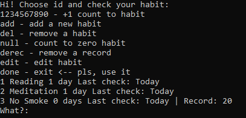

## What is this project for?

Our lives are surrounded by different habits. That's true. And how we interact with them will determine our life, whether it will go up or down, at least on the level of physical well-being.

Obviously, habits such as smoking, alcohol, drugs and others are very detrimental to human health. 

Apart from bad habits, there are some useful ones as well. For example, many people would like to do exercise, read a book or meditate every day. These are useful habits, there is no argument. But more often than not, you stick it out for 1-2 days and forget about them. And that's where your daily habit is forgotten. 

If interested in learning more about how habits affect our lives, I can recommend the book Atomic Habits by James Clear. 

As a complement to the ideas of this author, my project proposes to turn the process of acquiring or getting rid of habits into a kind of game where you can track your progress every day.

## How does this script look like?

